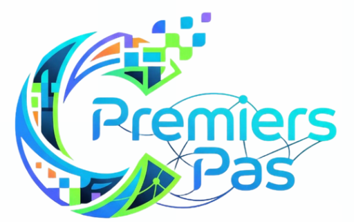

<div align="center">

<picture>
  <source media="(prefers-color-scheme: dark)" srcset="assets/logo-dark.png" />
  <source media="(prefers-color-scheme: light)" srcset="assets/logo-light.png" />
  
</picture>

<br/>

# Code Premier Pas &nbsp;·&nbsp; C2P

<p><em>"Les bases solides d'aujourd'hui sont les succes de demain."</em></p>

<p>
  <a href="https://chat.whatsapp.com/GNtDfxG6SzEHmDXRpovN3m">
    
  </a>
  &nbsp;
  <a href="https://www.linkedin.com/company/c2p-community/">
    
  </a>
  &nbsp;
  <a href="https://tcc.hyver.org/c/code-premier-pas">
    
  </a>
</p>

<p>
  
  
</p>

</div>

---

## ▸ Qu'est-ce que C2P ?

C2P est une communaute d'apprentissage des bases de la programmation, sise a **Lome, Togo**.  
On apprend a coder sans pression, avec methode et en s'entraidant.  
Des sessions pratiques, des defis concrets, et un espace d'echange sans jugement.

Les langages travailles :

<div align="center">

|  |  |  |  |
|---|---|---|---|

</div>

---

## ▸ vCODE — Le rendez-vous du vendredi

Chaque vendredi, la communaute se retrouve en live pour :

```
● Resoudre un probleme de code ensemble
● Decouvrir un nouveau concept — simple, direct, utile  
● Presenter les projets des equipes en binome
```

---

## ● Structure du repo

```
vCODE-c2p/
│
├── vCODE[N]/
│   ├── README.md              → Sujet + objectifs de la session
│   ├── ressources/            → Docs, slides, liens de reference
│   ├── replay/                → Lien replay + resume ecrit
│   └── equipes/
│       ├── binome-1/          → Code du binome 1
│       ├── binome-2/          → Code du binome 2
│       └── ...
│
├── ressources-globales/       → Ressources communes tous langages
├── projets-communautaires/    → Projets sur plusieurs sessions
├── annonces/                  → Roadmap et prochaines sessions
└── assets/                    → Logo et visuels de la communaute
```

---

## ● Par ou commencer ?

```
▸ Tu decouvres C2P ?          → Rejoins le WhatsApp ci-dessous
▸ Tu es membre actif ?        → Va dans vCODE[N] de la session en cours
▸ Tu cherches un replay ?     → vCODE[N]/replay/
▸ Tu veux des ressources ?    → ressources-globales/ ou vCODE[N]/ressources/
```

---

## ▸ Comment contribuer (membres actifs)

```bash
# 1. Clone ce repo
git clone : https://github.com/Paskod121/vCODEc2p.git

# 2. Place ton travail dans le bon dossier
#    vCODE[N]/equipes/binome-[X]/

# 3. Fais un commit clair
git commit -m "vCODE5 | binome-2 : solution finale"

# 4. Pousse
git push origin main
```

---

## ⌂ Nous rejoindre

<div align="center">

| Plateforme | Lien |
|---|---|
| WhatsApp | [Rejoindre le groupe](https://chat.whatsapp.com/GNtDfxG6SzEHmDXRpovN3m) |
| LinkedIn | [C2P Community](https://www.linkedin.com/company/c2p-community/) |
| Evenements TCC | [code-premier-pas](https://tcc.hyver.org/c/code-premier-pas) |

</div>

---

<div align="center">
<sub>Code Premier Pas (C2P) &nbsp;»&nbsp; Lome, Togo &nbsp;·&nbsp; Partenaire <a href="https://tcc.hyver.org">Tech Communities Clubs</a></sub>
</div>